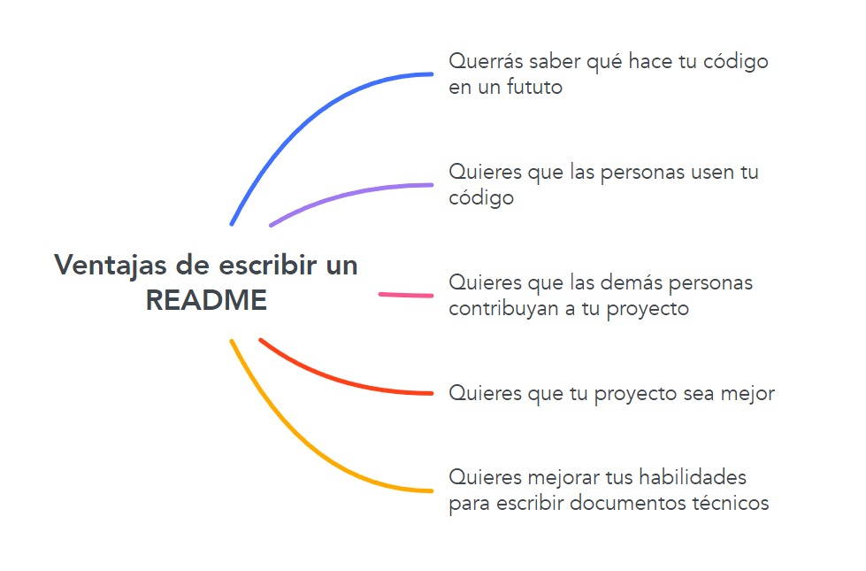

# Cómo hacer un README exitoso

El objetivo del archivo README es dar a conocer lo esencial de tu proyecto. En él explicarás qué hace y qué se necesita para usarlo. Este documente está dirigido principalmente a dos públicos, los usuarios y los desarrolladores.

Algunas ventajas de tener un README en tu proyecto son las siguientes [^1]:



## Contenido

El contenido depende de su propósito, en este caso para la 1ª edición del hackatón *Hello Mexicoders!* el objetivo es dar a conocer tu proyecto. Por lo que deberá incluir lo siguiente:

-	El nombre de tu proyecto como tu primer título.
-	Una descripción general del sistema o proyecto.
-	Una guía para la instalación y el funcionamiento.
-	Los requisitos del entorno de desarrollo para la integración.
-	Una lista de las tecnologías utilizadas.


Usar lenguaje claro es esencial para que el usuario no se quede con dudas después de leer el README. Un texto que es claro es aquel que se entiende a la primera y en el cual puedes encontrar la información que buscas fácilmente. 

## Formato

El README puede estar en cualquier formato de texto. Lo recomendado para este hackatón, y lo que usualmente se usa en el medio, es usar formato [Markdown](https://www.ionos.mx/digitalguide/paginas-web/desarrollo-web/tutorial-de-markdown/). Markdown convierte el texto a HTML con ayuda de caracteres de formateo. 

Ejemplo

```
## Título
### Subtítulo
Este es un ejemplo de texto que da entrada a una lista genérica de elementos:
- Elemento 1
- Elemento 2
- Elemento 3  
```

## Publicación

El archivo README debe de estar en la carpeta fuente de tu repositorio de Github. Github automáticamente detecta el nombre `README.md` y muestra su información en la primer página de tu proyecto.

## Referencias

[^1]: Write the Docs. "A beginner’s guide to writing documentation". Write the Docs. https://www.writethedocs.org/guide/writing/beginners-guide-to-docs/ (accedido el 30 de marzo de 2022).